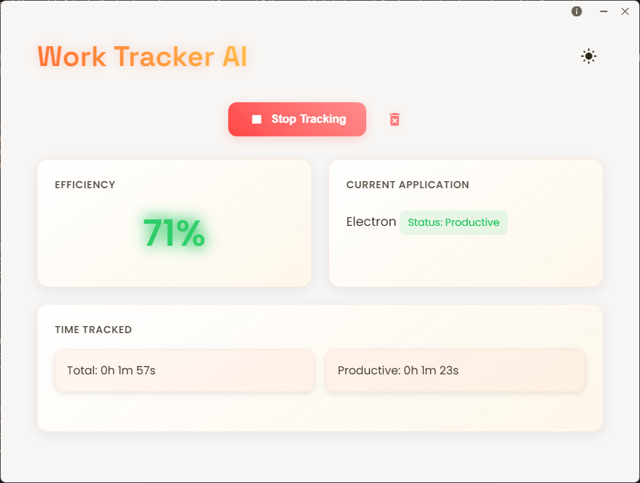
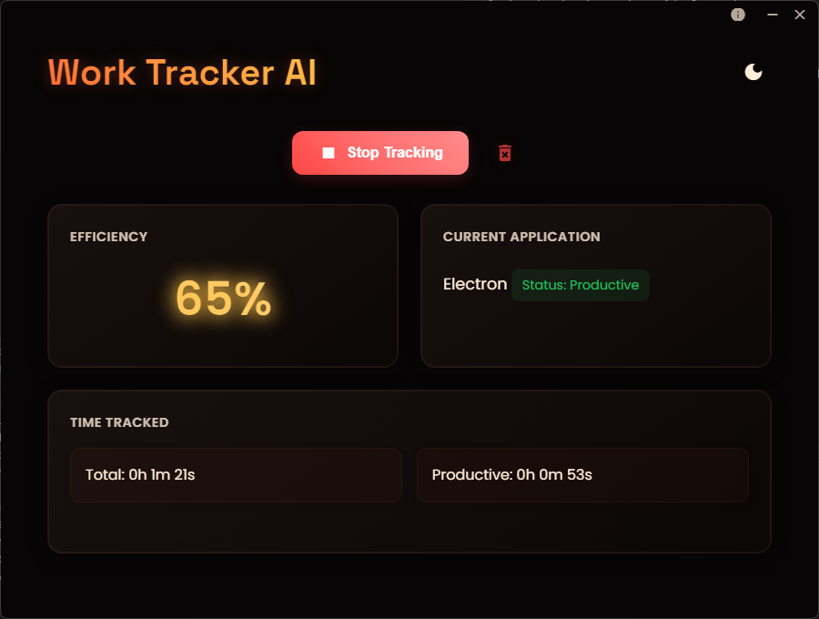

# 🎯 AI Work Tracker

> Boost your productivity with AI-powered activity tracking and insights

[](https://opensource.org/licenses/MIT)
[](https://github.com/alexkanchev/work-tracker-ai/releases)

## 📖 Overview

Work Tracker AI is a sleek, modern desktop application that helps you monitor and improve your productivity. It runs silently in the background, tracking your application usage and providing real-time efficiency scores.

## 🎨 Screenshots

<div align="center">
  
  
  
</div>

## ✨ Key Features

### 🎯 Real-Time Tracking
- Automatic application monitoring
- Intelligent productivity categorization
- Real-time efficiency scoring
- Dark/Light theme support

### 💻 Developer-Focused
- Recognizes popular IDEs and development tools
- Tracks coding time across different editors
- Supports version control applications
- Includes terminal and command-line tools

### 🛡️ Privacy & Performance
- Local-only data processing
- No cloud synchronization
- Minimal resource usage
- Completely private tracking

## 🚀 Getting Started

### Prerequisites
- Node.js (v14 or higher)
- npm package manager
- Windows 10+

### Installation

#### Option 1: Install from Release
1. Download the latest installer from [Releases](https://github.com/alexkanchev/work-tracker-ai/releases)
2. Run the installer
3. Launch Work Tracker AI from your Start Menu

#### Option 2: Build from Source
```bash
1. Clone the repository
git clone https://github.com/alexkanchev/AI-Work-Tracker.git

2. Install dependencies
npm install

3. Start the application
npm start

4. Build the installer
npm run dist
```

## 🎨 Interface

- **Clean, Modern Design**: Minimalist interface with smooth animations
- **Real-Time Updates**: Live efficiency tracking and application monitoring
- **Dark Mode**: Built-in dark mode support

## 🐛 Bug Reports

Found a bug? Please open an issue and include:
- Operating system version
- Steps to reproduce
- Expected vs actual behavior
- Screenshots if applicable

## 🔮 Roadmap

- [ ] Data persistence between sessions
- [ ] Custom application categories
- [ ] Detailed analytics dashboard
- [ ] Export capabilities
- [ ] Activity insights and suggestions

## 📄 License

This project is licensed under the MIT License - see the [LICENSE](LICENSE.txt) file for details.

## 🙏 Acknowledgments

- Icon by Adrien Coquet from Noun Project
- Created by [Aleksandar Kanchev](https://github.com/alexkanchev)

---

<div align="center">
Made by Aleksandar Kanchev 💖
</div>
