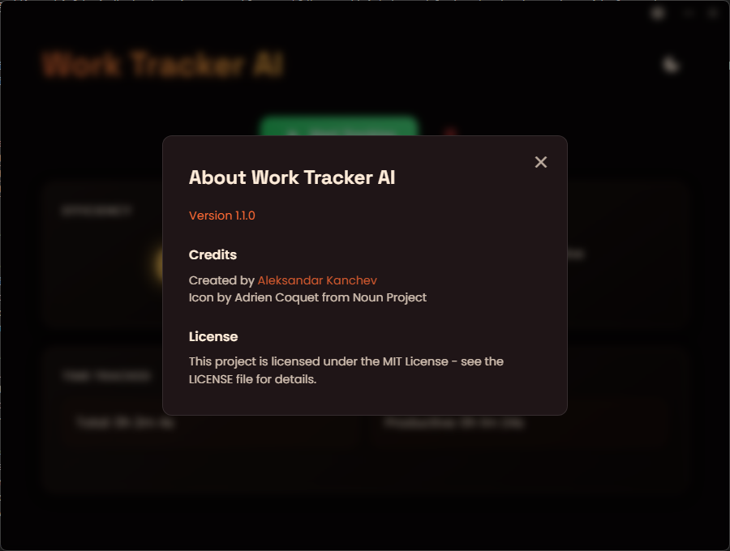

# 🎯 Work tracker AI

> Boost your productivity with AI-powered activity tracking and insights

[](https://opensource.org/licenses/MIT)
[](https://github.com/alexkanchev/work-tracker-ai/releases)

## 📖 Overview

Work Tracker AI is a sleek, modern desktop application that helps you monitor and improve your productivity. It runs silently in the background, tracking your application usage and providing real-time efficiency scores powered by AI analysis.
Uses TesseractOCR and Facebook's BART AI to determine what the user's doing.

## 🎨 Screenshots

<div align="center">
  
  
  
</div>

## ✨ Key Features

### 🎯 Advanced Tracking & Analysis
- Real-time application monitoring with AI-powered classification
- Intelligent productivity categorization using HuggingFace's BART model
- Dynamic content analysis for web applications
- Configurable caching system for optimal performance
- Efficiency scoring with visual feedback

### 🛡️ Privacy & Performance
- Local-only data processing and storage
- Efficient caching system for quick analysis
- No cloud synchronization required

## 🚀 Getting Started

### Prerequisites
- Node.js (v14 or higher)
- npm package manager
- Windows 10+
- HuggingFace API token (for AI analysis)

### Installation

#### Option 1: Install from Release
1. Download the latest installer from [Releases](https://github.com/alexkanchev/work-tracker-ai/releases)
2. Run the installer
3. Launch Work Tracker AI from your Start Menu

#### Option 2: Build from Source
```bash
# Clone the repository
git clone https://github.com/alexkanchev/work-tracker-ai.git

# Install dependencies
npm install

# Start the application
npm start

# Build the installer
npm run dist
```

### Environment Setup
Create a `.env` file with:
```env
HUGGINGFACE_TOKEN=your_token_here  # Required for AI-powered content analysis
```

### System Requirements
- Windows 10 or later
- Node.js v14 or higher
- 4GB RAM minimum
- 500MB free disk space

## 🐛 Bug Reports & Feedback

When reporting issues, please include:
- Operating system version and build
- Node.js version
- Steps to reproduce
- Log files (located in the app's user data directory)
- Screenshots/recordings if applicable
- Error messages from the console

## 🔮 Upcoming Features

- [x] Data persistence between sessions
- [x] Comprehensive application categories
- [x] Real-time AI analysis
- [x] Dark/Light theme support
- [x] System tray integration
- [x] Session management
- [ ] Custom category management
- [ ] Detailed analytics dashboard
- [ ] Data export capabilities
- [ ] Enhanced OCR functionality
- [ ] Multi-monitor support
- [ ] Activity insights and recommendations

## 📄 License

This project is licensed under the MIT License - see the [LICENSE](LICENSE.txt) file for details.

## 🙏 Acknowledgments

- Icon by Adrien Coquet from Noun Project
- BART model by Facebook/HuggingFace
- Tesseract OCR for text recognition
- Electron for cross-platform support

---

<div align="center">
Made by Aleksandar Kanchev 💖
</div>
